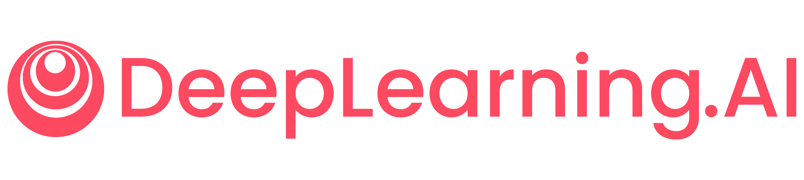

  

# Deep Learning Specialization: Coursera (Presented by deeplearning.ai)

[DeepLearning.AI](https://www.deeplearning.ai/) is a company founded by Andrew Ng, which offers a variety of courses on deep learning. The Deep Learning Specialization on Coursera is a series of five courses that cover the foundations of deep learning, building neural networks, structuring machine learning projects, and convolutional neural networks. The courses are taught by Andrew Ng, who is a pioneer in the field of deep learning.

This repository contains programming assignments from the [Deep Learning Specialization](https://www.coursera.org/specializations/deep-learning) on Coursera, provided by `deeplearning.ai`.

Course Instructor: [Andrew Ng](http://www.andrewng.org/)

## Supplementary Resources

### For comprehensive, interview-ready notes on all courses within the Coursera Deep Learning Specialization, please visit [www.aman.ai](https://aman.ai/).

## Ethical Considerations

I recognize the hard work that students put into learning new ideas, developing their intuition, and fixing problems with their assignments. The answers in this repository are only **meant to be used as examples**. Their purpose is to help you get past problems if you happen to run into them. I strongly warn against copying any part of the code word-for-word; the programming assignments are easy to handle if the rules are carefully followed. In the same way, I suggest that you take the quizzes on your own before looking at the answers. The deeplearning.ai team made this course, which is a useful resource because of its great material and structure.